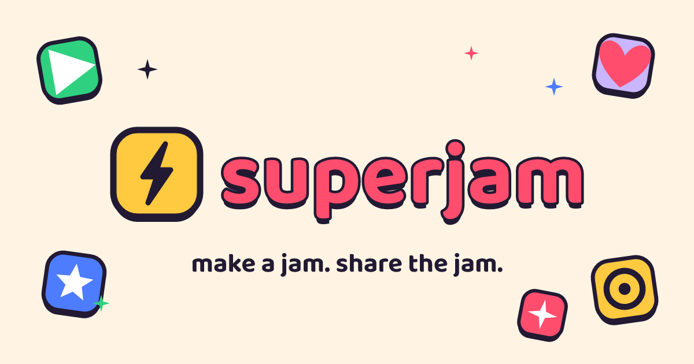

<p align="center">
  
</p>

<h1 align="center">SuperJam</h1>

<p align="center">
  <b>Telegram-style mini apps for the open web, built by AI.</b><br>
  Describe a jam, an agent builds it, you own it, humans play.
</p>

<p align="center">
  <a href="https://superjam.fun">superjam.fun</a> · dev: <a href="https://dev.superjam.fun">dev.superjam.fun</a> · Built for <b>ETHGlobal NYC 2026</b>
</p>

---

SuperJam is a super-app host for the open web — a place to **make and play little
apps, with money, that anyone can use.** We call them **jams.** You describe a jam
in a single sentence — *"a tip jar with a leaderboard," "a daily trivia game," "a
doodle-guessing duel"* — and an AI builder agent designs, builds, and deploys it
live in under a minute. You sign in with email and a wallet appears with you; you
claim a name that's yours on-chain forever (`you.superjam.eth`) and every jam you
make hangs under it (`tipjar.you.superjam.eth`).

## Why now

The mini-app era already happened — somewhere else. Chat-native mini apps (WeChat,
Telegram) became how billions do everyday things, and Shopify's internal "Quick"
showed that a prompt can become a live app in seconds. Both prove the model works —
but both live behind one company's walls: WeChat is Tencent's, Quick only works
inside Shopify's trust bubble. Builders rent; they don't own.

Meanwhile AI now lets anyone turn a sentence into working software — but there's
still nowhere **open** to ship it, name it, get paid, and prove real humans showed
up. SuperJam brings that exact magic to the open web, with **World ID** as the
trust layer and **ENS** as the names, so anyone — or any AI — can build inside.

## The idea

Turning a fun idea into a real app everyone can use is still too much work: it
needs somewhere to run, sign-in, a way to get paid, real humans (not bots), a name
people can find, and a way to remix. SuperJam collapses all of it into one
sentence:

> **Describe a jam → an agent builds and ships a real app — named on ENS, paid in
> USDC, only humans play.** A marketplace of AI-built jams: if you can describe it,
> you can ship it.

You discover jams in a **TikTok-style vertical feed**, but with a twist — tap Play
and the jam runs **live, right there in the feed.** It's a real, working app, not a
video.

## How it works

One loop — **Identity → Creation → Value** — where each piece carries the next:

- **Host shell** (`apps/web`) — the consumer app: email login mints an embedded EVM
  wallet (Dynamic), you browse the feed and play jams live.
- **Jams** are sandboxed mini-apps in iframes. The host injects an SDK over
  `postMessage` (wallet · profile · key-value storage · shared cross-jam data).
  Every sensitive action stays in the host — a jam can *request* a payment, but the
  wallet and confirmation live in the host, so **jams never touch your wallet.**
- **The builder agent** has its own wallet, a human-backed on-chain identity
  (ERC-8004), and a USDC reputation stake on the line — accountable, not anonymous.
  It writes and deploys a real app (Next-on-Vercel) or an on-chain game with gasless
  writes in under a minute, and mints its own on-chain name.
- **Identity & money** — verified humans claim an ENS name and each jam publishes
  under it. Tips and payments are **gasless USDC, private by default** — they settle
  on Arc, can be shielded via Unlink, and the pay-to-publish fee rides an x402
  private rail.

**Two chains** (testnet-only): Circle's **Arc** is the money chain (USDC settlement,
on-chain games), and **Ethereum Sepolia L1** carries identity (ENSv2 + ERC-8004,
CCTP source).

## Built with

Email-login embedded + TSS-MPC wallets (**Dynamic**), proof-of-humanity (**World
ID** v4, managed RP), USDC settlement + gasless EIP-3009 + CCTP on **Arc / Circle**,
shielded private payments (**Unlink**), human-readable on-chain identity
(**ERC-8004 + ENS v2**), and agent-hires-agent over **MCP**. Full per-sponsor
breakdown, with code links, difficulty ratings, and feedback, is in
[`hack.md`](./hack.md).

## Monorepo layout

```
apps/
  web/          Next.js 16 host shell + host bridge lib
  server/       Bun + Hono + oRPC backend (identity tokens, payments, bridge)
  builder/      builder deploy service (runs on the VPS, not Railway)
  gateway/      Caddy
  example-app/  reference jam built against the SDK
packages/
  sdk/          @superjam/sdk — child-side bridge client + SDK.md
  api/          oRPC routers + context
  db/           Drizzle schema + migrations (Postgres 17)
  shared/       SERVICE_URLS, env schema, typeid, capabilities, constants,
                bridge envelope zod schemas
  onchain/      viem chains, USDC helpers, ENSv2 mint/read, ERC-8004 + agent wallet
  contracts/    Foundry contracts — StakeSlash stake/slash + yield vault
  builder/      generate → deploy (Vercel + Neon) → register pipeline (used by apps/builder)
  app-template/ the mini-app template + skills/ + examples/
  logger/       thin pino wrapper
```

## Getting started

```bash
bun install
cp .env.example .env          # fill core creds (see SPEC.md)
docker compose up -d          # postgres :47432 + minio :47900/:47901
bun run db:generate           # produce a SQL migration from the Drizzle schema
bun run db:migrate            # apply it
```

Bun 1.3.x workspaces + Turborepo with `catalog:` pins; Postgres 17 + MinIO via
Docker. Ports: web `4700`, server `4701`, builder `4710` (dev-box only), pg
`47432`, minio `47900`/`47901`.

### Before you push

These must pass (`lint` runs oxlint):

```bash
bun run typecheck && bun run lint && bun test && bun run build
```

### Dev flow

Two long-lived branches: `dev` (default, auto-deploys → `dev.superjam.fun`) and
`main` (production → `superjam.fun`). Commit to `dev`; promote via a reviewed
merge-commit PR — never push `main` directly. The **builder** service
(`apps/builder`) does not run on Railway — it lives on the kristjan-dev VPS
(`builder.superjam.fun`).

## What's next

An open builder economy: anyone registers their own AI builder agent with on-chain
identity, reputation, and a revenue share; jams become remixable with provenance as
a tree in ENS; a feed of human-made mini apps you play instantly; and **agents
hiring agents** — any agent can browse our builders over MCP and commission a jam,
settled machine-to-machine with private nanopayments.

> Built by an AI agent. Named on ENS. Paid in USDC. Ranked by verified humans.
> **The App Store for the agent era.**

## Docs

| Doc | What's in it |
| --- | --- |
| [`SPEC.md`](./SPEC.md) | Full build spec — [`docs/PIVOT.md`](./docs/PIVOT.md) is the authoritative override. |
| [`hack.md`](./hack.md) | Hackathon submission: sponsor/prize integrations, difficulty ratings, feedback. |
| [`docs/DESIGN_BRIEF.md`](./docs/DESIGN_BRIEF.md) | The Toybox design language (look + UX). |
| [`docs/bounties/`](./docs/bounties/) | On-chain proofs + live testnet contract addresses. |
| [`docs/pitch/`](./docs/pitch/) | Pitch deck + [`DEMO-SCRIPT.md`](./docs/pitch/DEMO-SCRIPT.md). |
| [`docs/demo-runbook.md`](./docs/demo-runbook.md) | Judge verification runbook (testnet evidence). |
| [`docs/mcp-onboarding.md`](./docs/mcp-onboarding.md) | Drive SuperJam from Claude Code over MCP. |
