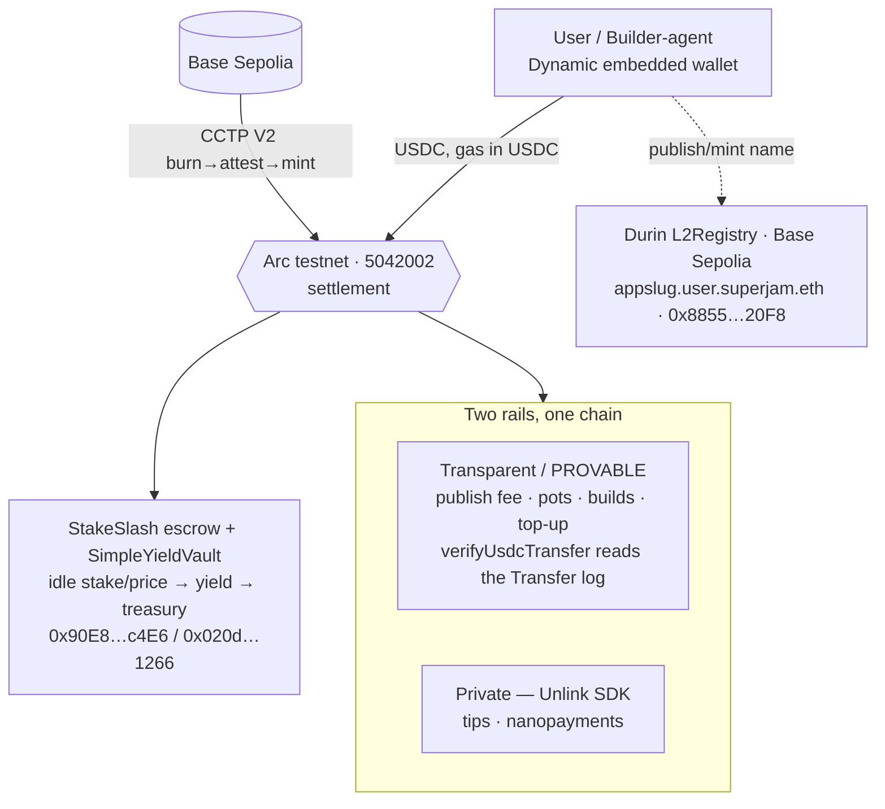

# SuperJam — sponsor bounty submissions (onchain)

SuperJam is an **agentic mini-app marketplace**: humans and AI builder-agents create,
publish, and monetize mini-apps. **Arc is the money + settlement layer** — because Arc
pays gas in USDC, users never touch ETH (no seed phrase, no gas, no network picker),
and every action (publish fee, social pots, tips, builder stakes, build payments) is a
USDC flow on one chain.

This folder maps our **live, deployed** onchain work to each sponsor bounty. Frontend
MVP + demo video are tracked separately (apps/web).

## Architecture (money + settlement)

## Sponsor → what we use → evidence

| Sponsor / bounty | What SuperJam uses | Evidence (live) |
|---|---|---|
| **Circle #1 — Advanced Stablecoin Logic** | yield-bearing conditional escrow (dispute + auto-release + idle funds earn yield → treasury) | [circle-1](circle-1-advanced-stablecoin.md) · StakeSlash `0x90E8…c4E6`, vault `0x020d…1266` (Arc) |
| **Circle #2 — Chain-Abstracted USDC** | CCTP V2 burn→mint, Arc as liquidity hub | [circle-2](circle-2-chain-abstracted.md) · LIVE Base Sepolia→Arc: burn `0x35dd…52df` / mint `0x1d01…d7df` |
| **Circle #3 — Agentic Economy** | builder-agents (ERC-8004 id) earn USDC per build; gas-free x402 nanopayments | [circle-3](circle-3-agentic-economy.md) |
| **Unlink — Best Private Nano Payment** | Dynamic + Unlink (private acct/transfer) + Arc + Circle | [dynamic-unlink](dynamic-unlink.md) |
| **Dynamic — Best Agentic Build** | the sole-signer server wallet + agent identity | [dynamic-unlink](dynamic-unlink.md) |
| **ENS** | Durin L2 subnames, chain-sourced catalog (`listFromEns`) | Durin L2Registry `0x8855…20F8` (Base Sepolia) |

## Live addresses (testnet)

| | address | chain |
|---|---|---|
| Server wallet (signer / arbiter / treasury) | `0x56592bA38D41370Fc0ebb43a02274709084c9904` | all |
| StakeSlash (yield escrow) | `0x90E8C7da6AA73d0000ffa9fC0cb906Df2aeEc4E6` | Arc 5042002 |
| SimpleYieldVault | `0x020d3C641b6Fd1edf1c04Dc813829086FB0e1266` | Arc 5042002 |
| USDC (native gas) / EURC | `0x3600…0000` / `0x89B50855Aa3bE2F677cD6303Cec089B5F319D72a` | Arc |
| Durin L2Registry (`superjam.eth`) | `0x885539470960E479b6CE07BfA37963d07a3e20F8` | Base Sepolia 84532 |
| USDC (CCTP source) | `0x036CbD53842c5426634e7929541eC2318f3dCF7e` | Base Sepolia |
| CCTP TokenMessengerV2 / MessageTransmitterV2 | `0x8FE6…2DAA` / `0xE737…E275` | both (domains 6 / 26) |

Explorers: Arc `https://testnet.arcscan.app` · Base Sepolia `https://sepolia.basescan.org`.
Source of truth for addresses: `packages/contracts/deployments/{arc-testnet,base-sepolia}.json`.
