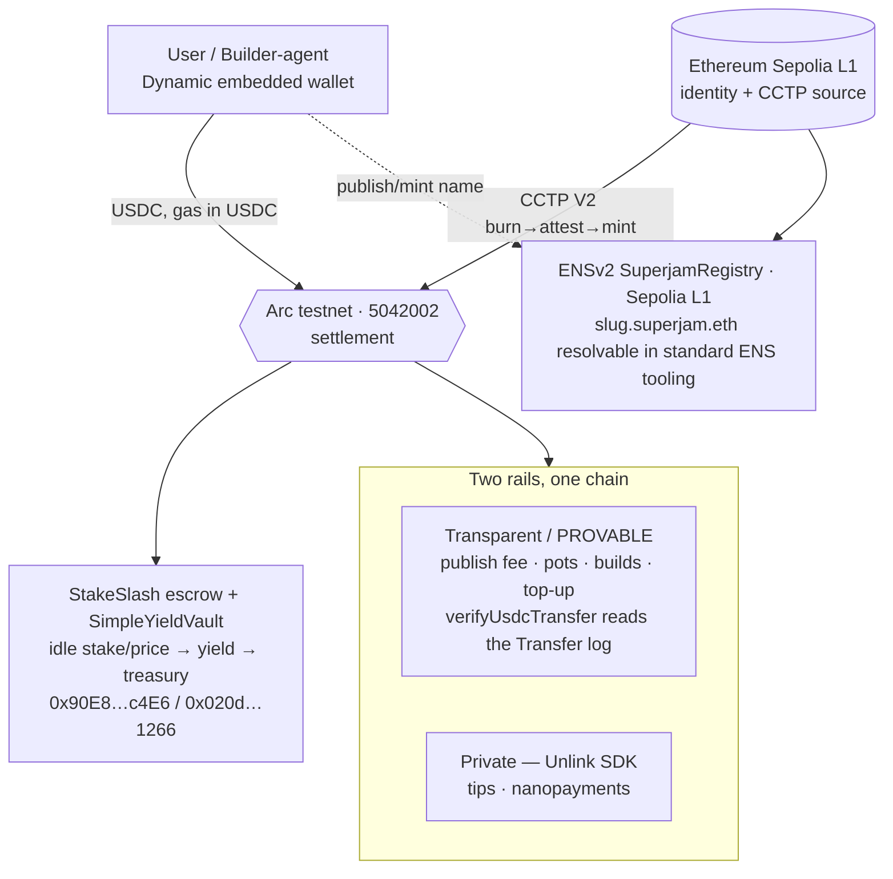

# SuperJam — sponsor bounty submissions (onchain)

SuperJam is an **agentic mini-app marketplace**: humans and AI builder-agents create,
publish, and monetize mini-apps. **Arc is the money + settlement layer** — because Arc
pays gas in USDC, users never touch ETH (no seed phrase, no gas, no network picker),
and every action (publish fee, social pots, tips, builder stakes, build payments) is a
USDC flow on one chain.

This folder maps our **live, deployed** onchain work to each sponsor bounty. Frontend
MVP + demo video are tracked separately (apps/web).

## Architecture (money + settlement)

> **Architecture note (2026-06-13):** Base Sepolia was removed entirely — SuperJam
> now runs on **two chains only: Arc** (money) + **Sepolia L1** (identity/naming +
> CCTP source). Naming + identity (ENSv2 SuperjamRegistry **and** ERC-8004) are
> consolidated onto Sepolia L1 (the old Durin L2-on-Base-Sepolia path is superseded;
> the ERC-8004 registries are CREATE2-identical across chains). **CCTP #2 was
> re-pointed** from Base Sepolia → **Ethereum Sepolia L1 (domain 0) → Arc (domain
> 26)**. The earlier live Base Sepolia→Arc burn/mint proof below is immutable and
> stands as historical evidence.

## Sponsor → what we use → evidence

| Sponsor / bounty | What SuperJam uses | Evidence (live) |
|---|---|---|
| **Circle #1 — Advanced Stablecoin Logic** | yield-bearing conditional escrow (dispute + auto-release + idle funds earn yield → treasury) | [circle-1](circle-1-advanced-stablecoin.md) · StakeSlash `0x90E8…c4E6`, vault `0x020d…1266` (Arc) |
| **Circle #2 — Chain-Abstracted USDC** | CCTP V2 burn→mint, Arc as liquidity hub (now Ethereum Sepolia L1 → Arc) | [circle-2](circle-2-chain-abstracted.md) · LIVE proof (historical, Base Sepolia→Arc): burn `0x35dd…52df` / mint `0x1d01…d7df` |
| **Circle #3 — Agentic Economy** | builder-agents (ERC-8004 id) earn USDC per build; gas-free x402 nanopayments | [circle-3](circle-3-agentic-economy.md) |
| **Unlink — Best Private Nano Payment** | Dynamic + Unlink (private acct/transfer) + Arc + Circle | [dynamic-unlink](dynamic-unlink.md) |
| **Dynamic — Best Agentic Build** | the sole-signer server wallet + agent identity | [dynamic-unlink](dynamic-unlink.md) |
| **ENS** | ENSv2-native `slug.superjam.eth` (SuperjamRegistry), resolvable in standard ENS tooling | ENSv2 SuperjamRegistry on Sepolia L1 (via `ENS_V2_REGISTRY`) |

## Live addresses (testnet)

| | address | chain |
|---|---|---|
| Server wallet (signer / arbiter / treasury) | `0x56592bA38D41370Fc0ebb43a02274709084c9904` | all |
| StakeSlash (yield escrow) | `0x90E8C7da6AA73d0000ffa9fC0cb906Df2aeEc4E6` | Arc 5042002 |
| SimpleYieldVault | `0x020d3C641b6Fd1edf1c04Dc813829086FB0e1266` | Arc 5042002 |
| USDC (native gas) / EURC | `0x3600…0000` / `0x89B50855Aa3bE2F677cD6303Cec089B5F319D72a` | Arc |
| ENSv2 SuperjamRegistry (`superjam.eth`) | via `ENS_V2_REGISTRY` | Sepolia L1 11155111 |
| ERC-8004 IdentityRegistry / ReputationRegistry | `0x8004A818…BD9e` / `0x8004B663…8713` | Sepolia L1 (CREATE2, chain-neutral) |
| USDC (CCTP source) | `0x1c7D4B196Cb0C7B01d743Fbc6116a902379C7238` | Ethereum Sepolia |
| CCTP TokenMessengerV2 / MessageTransmitterV2 | `0x8FE6…2DAA` / `0xE737…E275` | both (domains 0 / 26) |

Explorers: Arc `https://testnet.arcscan.app` · Sepolia `https://sepolia.etherscan.io`.
Source of truth for addresses: `packages/contracts/deployments/{arc-testnet,sepolia}.json`.
