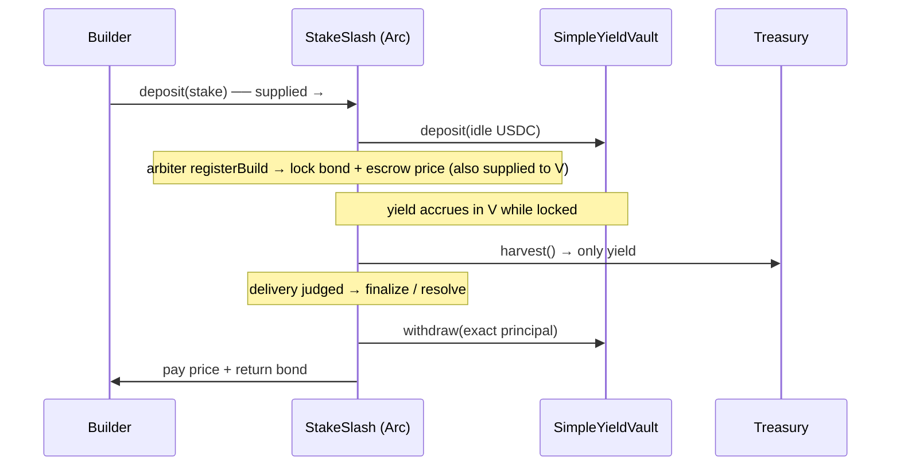

# Circle #1 — Best Smart Contracts on Arc with Advanced Stablecoin Logic

**Our submission: a yield-bearing conditional escrow** — SuperJam's builder
marketplace. It is the bounty's flagship example ("conditional escrow with onchain
dispute + automatic release") plus an advanced twist: **idle escrowed USDC earns
yield while locked, swept to the treasury — principal always returned in full.**

## What it does (programmable USDC logic)

A builder stakes USDC. When the platform assigns a paid build it **locks a bond**
from the builder's stake and **escrows the client's price**. Delivery is judged by a
layered optimistic process (deterministic deploy gate → AI score → community
challenge window):
- clean, unchallenged → permissionless `finalize`: builder reclaims bond + earns price;
- bad delivery → `resolve(slash=true)`: bond + price → treasury (or a correct
  challenger is refunded + rewarded);
- frivolous challenge → `resolve(slash=false)`: builder paid, challenger bond forfeited.

**The yield twist:** every USDC sitting in the contract (stakes, bonds, escrowed
prices) is supplied to an `IYieldAdapter` (our `SimpleYieldVault`, swappable for
Aave/Morpho). The contract tracks `totalPrincipal`; `harvest()` sweeps
`adapter.assetsOf(escrow) − totalPrincipal` (pure yield) to the treasury.
**Participant payouts always return exact principal — yield is platform upside.**
Multi-step settlement + onchain automation + conditional flows = the bounty's "USDC or EURC, advanced programmable logic" ask.

## Diagram

## Code
- `packages/contracts/src/StakeSlash.sol` — the escrow (deposit/withdraw/registerBuild/
  markDelivered/challenge/finalize/resolve + `harvest`, `_pullIn`/`_payOut` yield plumbing).
- `packages/contracts/src/SimpleYieldVault.sol` + `IYieldAdapter.sol` — ERC-4626-style
  yield source (yield via `accrue`; share price rises; `withdraw(assets)` exact).
- Tests: `packages/contracts/test/StakeSlash.t.sol` + `SimpleYieldVault.t.sol` — **16
  forge tests** incl. "harvest sweeps only yield, principal preserved", "finalize pays
  exact price despite yield", "full unwind empties vault", + 8 proving v1 behaviour
  unchanged with yield off.

## Live on Arc (chain 5042002)
- StakeSlash: `0x90E8C7da6AA73d0000ffa9fC0cb906Df2aeEc4E6`
- SimpleYieldVault: `0x020d3C641b6Fd1edf1c04Dc813829086FB0e1266`
- deploy tx: `0x17a22b49b1fb7b6ca1b6bc8a0ae1e154bb509b5bab27e919c76216a062f90d05`
- USDC `0x3600…0000` (native gas) / EURC `0x89B50855Aa3bE2F677cD6303Cec089B5F319D72a` — multi-currency ready.
- Redeploy: `packages/contracts` → `forge script script/Deploy.s.sol:Deploy --rpc-url $ARC_RPC_URL --private-key $SERVER_WALLET_PRIVATE_KEY --broadcast` (ARBITER=server wallet).

## Why Arc
Gas is paid in USDC, so the whole escrow runs without anyone holding ETH — a
dollar-native marketplace with predictable, sub-cent fees and sub-second finality.
