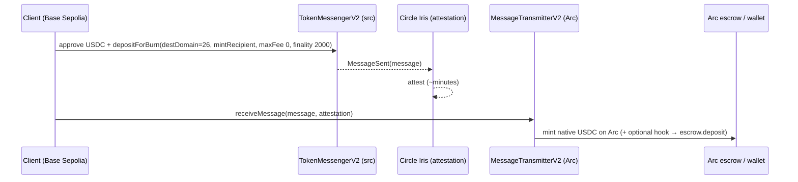

# Circle #2 — Best Chain-Abstracted USDC App (Arc as a Liquidity Hub)

**Our submission: source build-funding from any CCTP chain into the Arc builder
economy in one action.** A client funds a build with USDC on Base Sepolia (or any
CCTP chain); CCTP V2 burns it there and mints native USDC on Arc — optionally with a
`hookData` that atomically deposits into the StakeSlash escrow on arrival. Users treat
multiple chains as one liquidity surface; Arc is the settlement hub.

## Flow

## Code
- `packages/onchain/src/cctp.ts` — `createCctp({source,dest,iris}).bridge({amount,
  mintRecipient})`: approve → `depositForBurn` → `fetchAttestation` (Iris poller,
  injectable fetch) → `receiveMessage`. Domains/addresses + `toBytes32` helper.
- Tests: `packages/onchain/src/cctp.test.ts` — domains, bytes32 padding, the Iris
  poller (polls past pending → complete; times out → `RELAY_FAILED`).

## Addresses (CCTP V2 testnet — same CREATE2 on every chain)
- TokenMessengerV2 `0x8FE6B999Dc680CcFDD5Bf7EB0974218be2542DAA`
- MessageTransmitterV2 `0xE737e5cEBEEBa77EFE34D4aa090756590b1CE275`
- TokenMinterV2 `0xb43db544E2c27092c107639Ad201b3dEfAbcF192`
- Domains: **Base Sepolia 6 → Arc 26** (Ethereum Sepolia 0 also supported).
- Iris (sandbox): `https://iris-api-sandbox.circle.com/v2/messages/{srcDomain}?transactionHash=…`

## Status
Adapter built + unit-tested; a live cross-chain run (burn on Base Sepolia → mint on
Arc) is the gated demo (~minutes for Iris). Source liquidity = the wallet's 20 Base
Sepolia USDC. The `hookData` variant (atomic deposit into StakeSlash on arrival) is
the documented extension.
