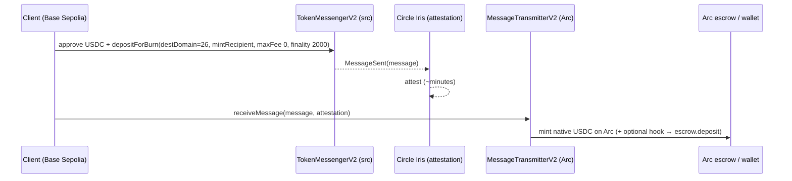

# Circle #2 — Best Chain-Abstracted USDC App (Arc as a Liquidity Hub)

**Our submission: source build-funding from any CCTP chain into the Arc builder
economy in one action.** A client funds a build with USDC on Base Sepolia (or any
CCTP chain); CCTP V2 burns it there and mints native USDC on Arc — optionally with a
`hookData` that atomically deposits into the StakeSlash escrow on arrival. Users treat
multiple chains as one liquidity surface; Arc is the settlement hub.

## Flow

## Code
- `packages/onchain/src/cctp.ts` — `createCctp({source,dest,iris}).bridge({amount,
  mintRecipient})`: approve (await receipt) → `depositForBurn` → `fetchAttestation`
  (Iris poller, injectable fetch) → `receiveMessage`. Domains/addresses + `toBytes32`.
- Tests: `packages/onchain/src/cctp.test.ts` — domains, bytes32 padding, the Iris
  poller (polls past pending → complete; times out → `RELAY_FAILED`).
- Live proof: `packages/onchain/integration/cctp.itest.ts` (gated
  `RUN_ONCHAIN_INTEGRATION=1`) bridges a real amount Base Sepolia → Arc.

## Addresses (CCTP V2 testnet — same CREATE2 on every chain)
- TokenMessengerV2 `0x8FE6B999Dc680CcFDD5Bf7EB0974218be2542DAA`
- MessageTransmitterV2 `0xE737e5cEBEEBa77EFE34D4aa090756590b1CE275`
- TokenMinterV2 `0xb43db544E2c27092c107639Ad201b3dEfAbcF192`
- Domains: **Base Sepolia 6 → Arc 26** (Ethereum Sepolia 0 also supported).
- Iris (sandbox): `https://iris-api-sandbox.circle.com/v2/messages/{srcDomain}?transactionHash=…`

## Live cross-chain proof (real txs, 2026-06-13)
A real CCTP V2 transfer run end-to-end via `cctp.ts`: 0.05 USDC burned on Base Sepolia
→ Iris attested (after Base Sepolia finalization, ~13 min) → minted native USDC on Arc.
Pre-flight confirmed CCTP V2 is live on Arc: `MessageTransmitter.localDomain() == 26`.

| step | chain | tx |
|---|---|---|
| `depositForBurn` (burn) | Base Sepolia (domain 6) | `0x35dd94874688ed7b04304224748def16abeb3ffe3601e1204aacc6e0191552df` |
| `receiveMessage` (mint) | Arc (domain 26) | `0x1d019c71aa6fdf6851efa275df0fb1262759f527e5b8ca880fccbdeecdf6d7df` |

(Burn on `sepolia.basescan.org`; mint on `https://testnet.arcscan.app`.)

## hookData — atomic cross-chain stake into the escrow (LIVE, 2026-06-13)
The flagship variant: a burn on any CCTP chain with `hookData = abi.encode(builder)`
and `mintRecipient = the Arc hook contract` lands the USDC **directly as that
builder's stake in the Arc marketplace, in one cross-chain action**. CCTP core treats
hookData as opaque metadata, so we deploy the destination executor:
- `packages/contracts/src/CctpEscrowHook.sol` — `relay(message, attestation)`:
  `receiveMessage` mints to the hook → decodes `builder` from the message's hookData
  (offset 376 = 148-byte V2 header + 228-byte BurnMessageV2 body) → `StakeSlash.depositFor(builder, minted)`.
- `StakeSlash.depositFor(builder, amount)` — additive: credits a builder's stake from
  a third-party (the hook) deposit. `cctp.ts` `bridge({hookData})` →
  `depositForBurnWithHook` on source + `hook.relay` on dest.
- Deployed on Arc: CctpEscrowHook `0xf67d3e49a010E973ec2AcdEF00cA24A7A6794ec8`,
  StakeSlash(+depositFor) `0xA527879D4fc7538180771bd02CA6c3B0E609BD29`.

| step | chain | tx |
|---|---|---|
| `depositForBurnWithHook` (burn + hook) | Base Sepolia (6) | `0x3db67d3deb505845dd7e8353e9524b55c7986f78a5a25947a296d6c9e954bb9c` |
| `relay` → mint + `depositFor` (atomic) | Arc (26) | `0x74bbc06a5785e1944ff297cf49b7d27d601260add228a0abf659180c271f03f8` |

Result: the builder's on-chain `stake` rose 0 → 0.02 USDC cross-chain — the mint and
the escrow deposit happened in the single `relay` tx.

## Status
Adapter built + unit-tested + **proven live** end-to-end: both the plain burn→mint
and the **hookData atomic cross-chain stake** (tables above). 21 forge tests + 7 cctp
unit tests pass.
