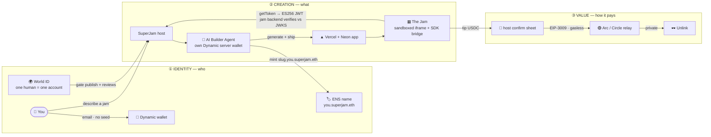

# SuperJam — Architecture (design handoff)

> **For the designer:** produce ONE clean architecture diagram from this spec. It
> doubles as the slide-5 visual in the deck AND the architecture diagram Arc/Circle
> require for their prize. Keep the **Toybox** brand (see *Visual direction*). The
> goal a judge should take away in 5 seconds: **every sponsor is on the critical
> path, not bolted on.**

## The one-liner
**Describe a toy. An AI agent builds and ships it. You own the name, you get paid,
and only real humans play.**

SuperJam is a marketplace of **"jams"** — small apps/toys you create just by
describing them. An AI agent generates and deploys each jam as a real, live web app;
the platform wraps it with identity, payments, naming, and a human-only gate.

## The loop (what the diagram shows)
Draw it as a left-to-right **loop** in three labelled bands. Each band is a "ring":

**Ring 1 — Identity (who)**
- 👤 **You** → email login, *no seed phrase* → 🔑 **Dynamic** embedded wallet.
- 🌍 **World ID** proof-of-human → "one human = one account" (gates publish + reviews).
- 🏷️ **ENS** name = your handle (`you.superjam.eth`) + every jam's name.

**Ring 2 — Creation (what)**
- You type a prompt → 🤖 **AI Builder Agent** (has its *own* Dynamic server wallet).
- Agent **generates a Next.js app + Neon DB** → **deploys to Vercel** → registers its
  `entryUrl`.
- Agent **mints `slug.you.superjam.eth`** on ENS (L2) for the new jam.
- The jam runs in a **sandboxed cross-origin iframe** + a postMessage **SDK bridge**;
  it calls back for identity (`sdk.auth.getToken()` → an ES256 JWT the jam's own
  backend verifies against the platform's JWKS).

**Ring 3 — Value (how it pays)**
- Inside a jam you **tip USDC** → host **confirm sheet** (the only thing that touches
  your wallet) → **EIP-3009 gasless** transfer → **server wallet relays on Arc**
  (gas paid in USDC, no ETH) → optionally **private via Unlink**.

## Diagram skeleton (reference — redraw in the brand)

## Caption (put under the diagram)
*"One loop. Dynamic = invisible wallets + an autonomous agent wallet. ENS = a name
for every agent-built app. World ID = a bot wall for an open marketplace. Arc/Circle
= gasless USDC so micro-tips actually work. Unlink = and private."*

## Tech stack (small footer, optional)
Next.js 16 · Hono + oRPC · Drizzle + Postgres/Neon · Dynamic (auth + embedded +
server wallet) · World ID 4.0 · ENS L2 (Durin/ENSv2) · USDC EIP-3009 on Arc · Circle
Gateway · Unlink. Jams are external apps (Vercel + own DB) framed cross-origin and
unified only by the SDK + identity + payments + naming.

## Visual direction — "Toybox"
The brand is **playful and warm — a name tag on a toy, not cold crypto/bank UI.**
- **Palette:** cream background; bold dark "ink" outlines; bright sticker accents —
  green, yellow, pink, blue.
- **Shapes:** rounded "toy" corners, chunky drop-shadows (sticker shadow), slight
  playful tilts (±5°), emoji "tokens" in rounded squares.
- **Type:** friendly, heavy/extrabold display for headlines; clean sans for body.
- **Tone:** approachable, fun, confident. Avoid dark dashboards, gradients-as-crypto,
  hexagons. Think *App Store meets sticker book.*
- Sponsor logos appear **at the node where the tech does real work** (small, tasteful).

## What "done" looks like
A single landscape diagram, brand-styled, readable on a projector, with the three
rings clearly labelled and the five sponsor logos placed on their real touchpoints,
plus the one-line caption.
